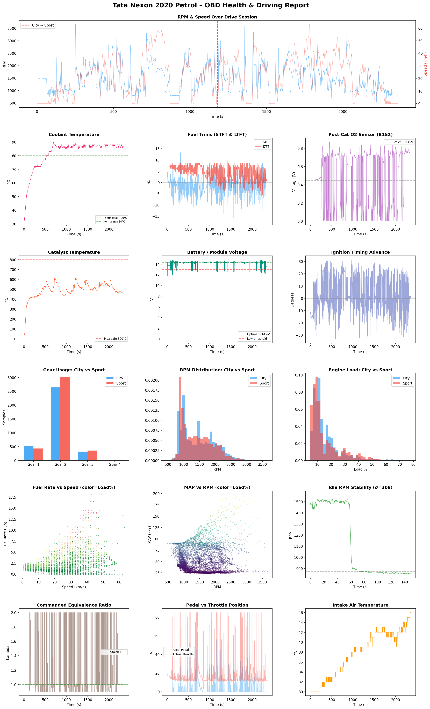

# ESP32 OBD2 CAN Logger

A DIY OBD2 data logger built with an ESP32. Reads live engine data over CAN bus, logs to CSV (SD card or internal flash), shows live values on a small OLED display, and serves a real-time web dashboard over WiFi.

> **Note:** Only tested on a **2020 Tata Nexon 1.2L Turbo Petrol (6-speed manual)**. Should work on any car with standard OBD2 over CAN (ISO 15765-4, 500 kbps).

## Using AI to review your driving data

Download the CSV from the WiFi dashboard and upload it to an AI model like **Claude** or **Gemini Pro**. You can ask questions like:

- "How is the turbo performance?"
- "Review if all sensors are working correctly and flag any issues"
- "Is the fuel trim normal or is the engine running rich/lean?"
- "Any signs of engine problems based on this data?"

The AI can analyze thousands of rows of sensor data in seconds and give you a plain-English health report of your car.

Here's an example report generated from a real driving session:



## What it does

- Reads **30+ OBD2 PIDs**: RPM, speed, coolant temp, oil temp, MAP, IAT, engine load, timing advance, throttle, accelerator pedal, fuel trims, O2 sensors, catalyst temp, fuel rate, voltage, and more
- **Logs to CSV** at ~4 Hz with automatic session numbering — SD card preferred, falls back to ESP32 internal flash (LittleFS) if no SD card is present
- **OLED display** (optional) — rotates between live data, running averages, and session stats (max boost, trip distance, fuel economy)
- **WiFi dashboard** — connect your phone to see live gauges, download CSV files, and check PID status
- **Smart polling** — fast-changing PIDs polled at ~4 Hz, slow-changing PIDs at ~1 Hz
- **Auto-disables unsupported PIDs** — if a PID times out 10 times in a row, it stops polling it
- **Estimates current gear** from RPM/speed ratio (calibrated for Nexon 6MT gearbox)

## Parts list

| Part | Notes |
|------|-------|
| [ESP32 Dev Board](https://robocraze.com/products/esp32-development-board) | Any ESP32-WROOM-32 dev board works |
| [TJA1050 CAN Module](https://robu.in/product/tja1050-can-module-green-board/) | 5V module — needs a voltage divider on RX (see wiring). A 3.3V CAN module (e.g. SN65HVD230) is easier if you can find one |
| [Micro SD Card Module](https://robu.in/product/micro-sd-card-module/) *(optional)* | HW-125 with onboard level shifter. Power from 5V. Without it, logs to ESP32 internal flash (~1.5 MB) |
| [0.96" SSD1306 OLED Display](https://robu.in/product/0-96-oled-display-module-spi-i2c-128x64-7-pin-blue/) *(optional)* | 128x64, I2C. The logger works without it |
| [OBD2 Extension Cable](https://www.amazon.in/dp/B0F6NGFKQT) | 16-pin male to female — splice into the male end for CAN High/Low |
| SD Card *(optional)* | I use a SanDisk Ultra 64GB. Any size works — CSV files are small |
| Jumper wires, solder, etc. | -- |

I mostly order from [robocraze.com](https://robocraze.com) or [robu.in](https://robu.in) — check both for availability and pricing.

## Wiring

Full wiring details below.

### ESP32 to TJA1050 CAN Module

```
ESP32 GPIO5  ──────────────────  TJA1050 TXD
ESP32 GPIO4  ──┬── 1kΩ ────────  TJA1050 RXD     (voltage divider: 5V → 3.4V)
               └── 2.2kΩ ─────  GND
ESP32 5V     ──────────────────  TJA1050 VCC
ESP32 GND    ──────────────────  TJA1050 GND
```

> If using a 3.3V CAN transceiver (e.g. SN65HVD230), skip the voltage divider and connect RX directly.

### TJA1050 to OBD2 Connector

```
TJA1050 CANH  ──  OBD2 Pin 6  (CAN High)
TJA1050 CANL  ──  OBD2 Pin 14 (CAN Low)
TJA1050 GND     ──  OBD2 Pin 4 or 5  (Chassis/Signal Ground)
```

### ESP32 to SD Card Module (HW-125) — optional

```
ESP32 GND    ──  GND
ESP32 5V     ──  VCC
ESP32 GPIO19 ──  MISO
ESP32 GPIO23 ──  MOSI
ESP32 GPIO18 ──  SCK
ESP32 GPIO15 ──  CS
```

> If no SD card module is connected, the logger automatically falls back to the ESP32's internal flash (LittleFS, ~1.5 MB). This gives you roughly 30 minutes of logging. Download the CSV over WiFi before it fills up.

### ESP32 to OLED Display (optional)

```
ESP32 GND    ──  GND
ESP32 3.3V   ──  VCC
ESP32 GPIO21 ──  SDA
ESP32 GPIO22 ──  SCL
```

## Flashing

### Prerequisites

1. Install the [Arduino IDE](https://www.arduino.cc/en/software) (v2.x recommended)
2. Add ESP32 board support:
   - Go to **Tools → Board → Boards Manager**, search "esp32", install **esp32 by Espressif Systems**
3. Install required libraries via **Sketch → Include Library → Manage Libraries**:
   - `Adafruit SSD1306`
   - `Adafruit GFX Library`

   (SD, SPI, Wire, WiFi, and WebServer are included with the ESP32 board package.)

### Upload

1. Connect the ESP32 via USB
2. Open `main/main.ino` in Arduino IDE
3. Select your board: **Tools → Board → ESP32 Dev Module**
4. Select the correct port: **Tools → Port**
5. Click **Upload**

## Usage

### 1. Power up

Plug the ESP32 into the car's USB port (or a USB power bank for bench testing). The OBD2 extension cable connects to the car's OBD2 port under the dashboard.

On startup, the OLED (if connected) shows:
```
Nexon CAN Logger

SD  Session #1            (or "LittleFS  Session #1" if no SD card)
Total: 59000 MB
Used:  12 MB
Free:  58988 MB
```

The serial monitor (115200 baud) shows the same info plus CAN bus init status.

### 2. Connect to the WiFi dashboard

1. On your phone, connect to WiFi network: **`obd2logger`** (password: `logger@ka01`)
2. Open a browser and go to **`http://192.168.4.1`**

You'll see a live dashboard with all the gauges updating every second:

- **Dashboard** (`/`) — live gauges for all PIDs, storage bar, download/session links
- **All Sessions** (`/sessions`) — list of all logged sessions with download and delete options
- **Download Current** (`/download`) — download the active session CSV
- **Debug Log** (`/log`) — ring buffer of recent debug messages
- **PID Status** (`/timeouts`) — see which PIDs are responding and which got auto-disabled

### 3. Data logging

Logging starts automatically on boot. Each power cycle creates a new session file (`s001.csv`, `s002.csv`, ...). With an SD card, files are stored in `/data/` on the card. Without one, they go to the ESP32's internal flash (LittleFS).

CSV columns:
```
Timestamp_ms, RPM, Speed_kmh, Coolant_C, OilTemp_C, MAP_kPa, IAT_C,
Load_pct, TimingAdv_deg, Throttle_pct, AccelPedal_pct, CmdThrottle_pct,
DemandTorque_pct, ActualTorque_pct, STFT_pct, LTFT_pct, Baro_kPa,
O2S2_V, O2S2_STFT_pct, CmdEquivRatio, CatalystTemp_C, O2_SecLTFT_pct,
Gear, FuelLevel_pct, FuelRate_Lph, ModuleVoltage_V, AmbientTemp_C,
RefTorque_Nm, O2S1_Lambda, O2S1_Current_mA, AbsLoad_pct, EvapPurge_pct
```

### 4. Serial monitor output

At 115200 baud, you'll see a continuous stream like:
```
RPM:850 Spd:0 Clt:82 Oil:78 MAP:33 IAT:42 Load:18% Tmg:6.5 Thr:14% ...
```

Plus periodic status:
```
[12345] TX:482 RX:391 RX_timeout:91
[12345] TWAI state:1 txErr:0 rxErr:0 txQ:0 rxQ:0
```

## Notes

- **SD card is optional.** If no SD card is found, the logger falls back to ESP32 internal flash (LittleFS, ~1.5 MB). That's roughly 30 minutes of logging at 4 Hz — download the CSV over WiFi before it fills up. If neither SD nor LittleFS can mount, the ESP32 won't start (nothing to log to).
- **OLED is optional.** If not connected, everything else works normally.
- **Not all PIDs will work on every car.** The logger auto-disables PIDs that your car's ECU doesn't support. Check the PID Status page (`/timeouts`) to see which ones your car responds to.
- **Gear estimation** is calibrated for the Nexon 1.2T 6-speed manual gearbox. If you're using a different car, you'll need to adjust the `GEAR_RATIO_MIN[]` and `GEAR_RATIO_MAX[]` arrays in the code.
- **WiFi range** is limited to a few meters — it's meant for use inside the car.

## License

This project is licensed under [CC BY-NC 4.0](https://creativecommons.org/licenses/by-nc/4.0/) — free to use, share, and modify for non-commercial purposes with attribution. No warranty.
